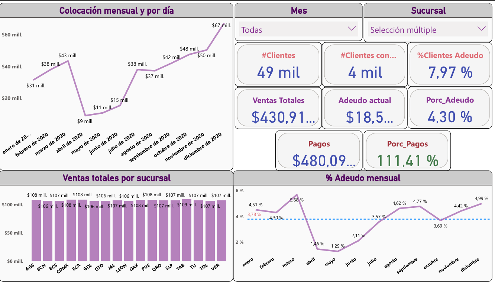

# 🔍 Proyecto Power BI - Análisis de Colocación y Adeudo 🎯
## Recientemente he trabajado en un pequeño informe interactivo con Power BI que proporciona una visión clara y precisa de la colocación (ventas mensuales) en distintas sucursales. 
## El informe incorpora:
### ✨ Jerarquías por fecha que no se ven afectadas por los filtros.
### ✨ Slicers que permiten filtrar por fecha y sucursal para un análisis más detallado.
### ✨ Tarjetas dinámicas que muestran métricas claves como montos de colocación, créditos, pagos, y porcentajes de adeudo, con formato condicional para visualizar rápidamente los puntos críticos.
### ✨ Gráficas que desglosan la colocación por sucursal y muestran el porcentaje de adeudo para facilitar la toma de decisiones.

## Este informe permite a los usuarios obtener insights clave de manera intuitiva, optimizando el proceso de análisis de datos financieros y operativos.
Espero puedan apoyarme brindando su tiempo, con una retroalimentación para poder mejorar 😁 . Gracias.

