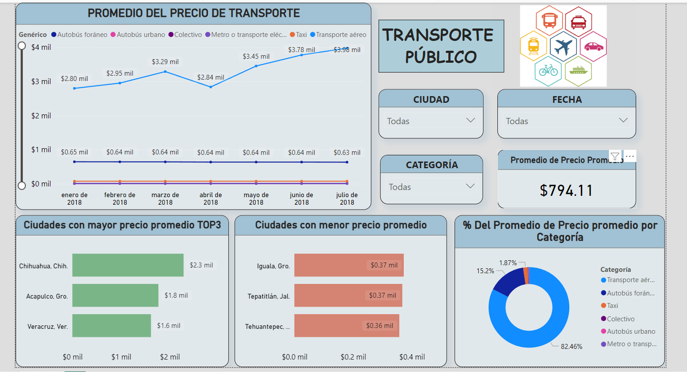

# 🚍 Proyecto Power BI - Análisis de Precios de Transporte en 2018 📊
Recientemente he trabajado en un informe en Power BI que analiza el precio mensual promedio del transporte de enero a julio de 2018, dividido por categorías de transporte. 
El informe incluye:
## 🔸 Una gráfica dinámica que permite explorar los precios por mes y tipo de transporte.
## 🔸 Slicers para filtrar por ciudad, fecha y categoría, ofreciendo una vista personalizada.
## 🔸 Tarjeta con el precio promedio del transporte para facilitar la interpretación.
## 🔸 Una tabla comparativa que destaca las 3 ciudades más caras y las 3 más económicas por categoría.
## 🔸 Una gráfica de torta para visualizar el desglose por categorías.
Este proyecto ha sido una gran oportunidad para profundizar en el análisis de datos y descubrir tendencias en los precios del transporte.

