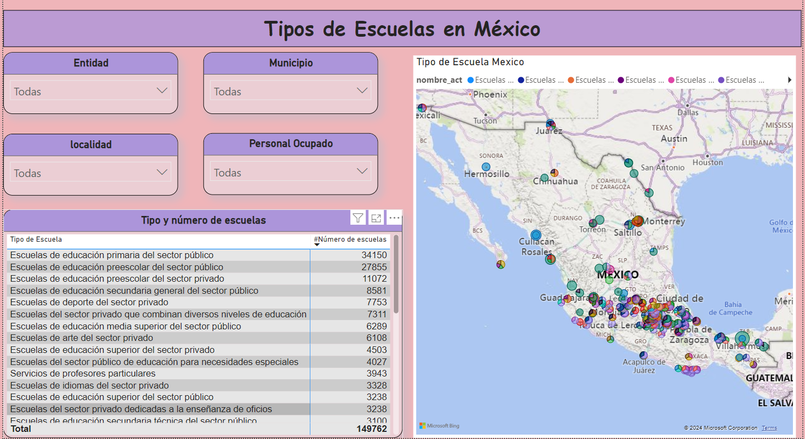

# 🏫 Pequeño Informe Power BI - Tipos de Escuelas en México 🌍
## He creado un pequeño informe en Power BI como parte de mi práctica continua, centrado en los tipos de escuelas en México. El informe incluye:
## 🔸 Slicers para filtrar por personal, entidad, localidad y municipio.
## 🔸 Una matriz con el nombre de las escuelas, su categoría y un recuento.
## 🔸 Un mapa interactivo que permite visualizar la ubicación de las escuelas por zona.
## Este ejercicio me ha ayudado a seguir afinando mis habilidades en Power BI y a explorar nuevas formas de analizar datos geográficos.

